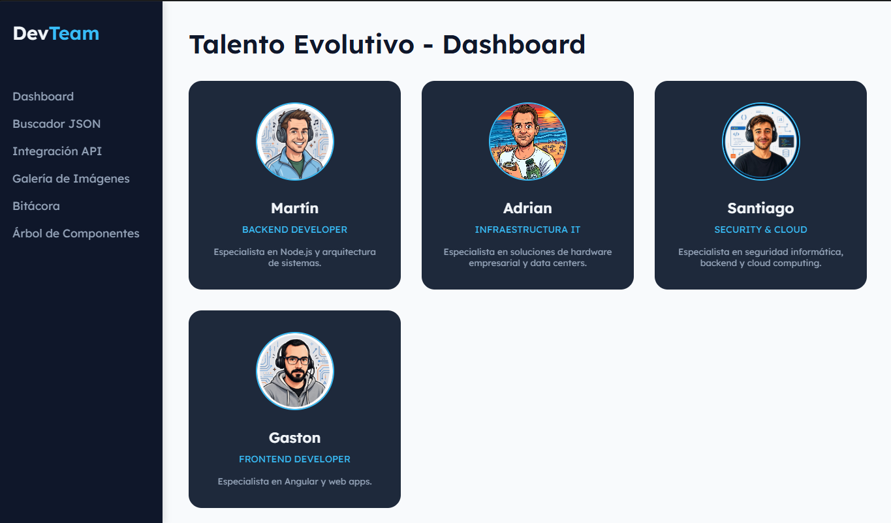
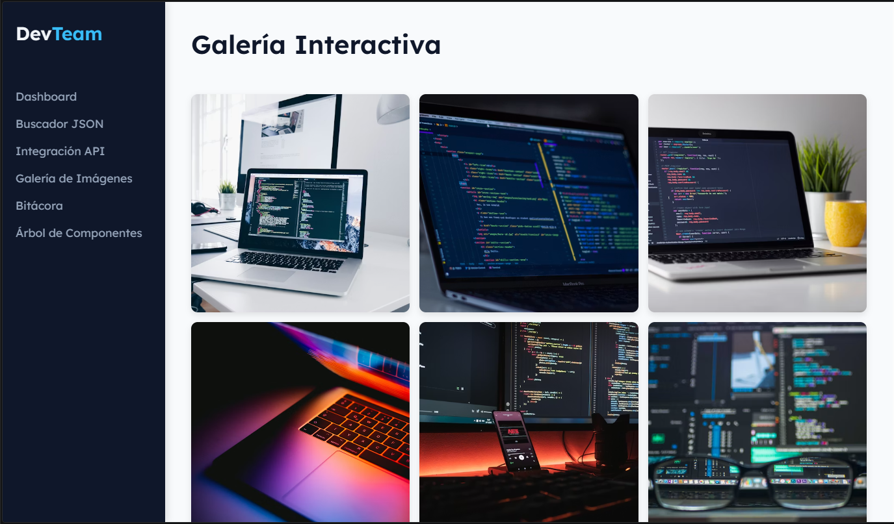

# 🚀 DevTeam Dashboard - Trabajo Práctico 2

**Link al Deploy en Vercel:** [URL_DE_VERCEL_AQUÍ]

## 1. Título del Proyecto
**DevTeam Dashboard SPA** - Trabajo Práctico Grupal N° 2

## 2. Descripción
El propósito de este proyecto es presentar el portafolio y las herramientas de nuestro equipo de desarrollo ("DevTeam") a través de una Single Page Application (SPA). Funciona como un Dashboard interactivo que incluye: perfiles dinámicos por integrante, un buscador en tiempo real sobre datos locales (JSON), integración asíncrona con la API pública de GitHub con sistema de paginación, y una galería de imágenes interactiva tipo Lightbox.

## 3. Integrantes
| Nombre | Rol principal | GitHub |
| :--- | :--- | :--- |
| **Martín** | Backend Developer | [Perfil de GitHub](https://github.com/Marto85) |
| **Adrian** | Infraestructura IT | [Perfil de GitHub](https://github.com/MaverickARG) |
| **Santiago** | Security & Cloud | [Perfil de GitHub](https://github.com/santicuda) |
| **Gaston** | Frontend Developer | [Perfil de GitHub](https://github.com/zamparg) |

## 4. Tecnologías Utilizadas
*   **Core:** React, JavaScript (ES6+), HTML5, CSS3.
*   **Routing:** React Router v6 (Manejo de rutas dinámicas y SPA).
*   **Entorno & Build:** Vite.
*   **Despliegue:** Vercel.
*   **Control de Versiones:** Git y GitHub (Flujo GitFlow).
*   **Recursos Visuales:** Google Fonts, Unsplash (Galería).

## 5. Estructura de Archivos
La arquitectura del proyecto está modularizada para favorecer la escalabilidad:

```text
src/
 ├── components/       # Componentes reutilizables (Sidebar.jsx, Layout.jsx)
 ├── pages/            # Vistas principales de la SPA
 │    ├── Home.jsx       # Dashboard principal
 │    ├── Perfil.jsx     # Perfil dinámico por integrante
 │    ├── Explorador.jsx # Buscador JSON en tiempo real
 │    ├── Api.jsx        # Integración con GitHub API
 │    ├── Galeria.jsx    # Lightbox modal interactivo
 │    ├── Bitacora.jsx   # Documentación teórica
 │    └── Arbol.jsx      # Árbol de Renderizado interactivo
 ├── datos.json        # Base de datos local (20 objetos para buscador)
 ├── index.css         # Hoja de estilos global y variables CSS
 ├── App.jsx           # Configuración del React Router
 └── main.jsx          # Punto de entrada de la aplicación
```

## 6. Guía de Estilos
*   **Tipografía:** Lexend (Google Fonts). Fue elegida por su excelente legibilidad en interfaces tipo Dashboard.
*   **Paleta de Colores:**
    *   `Background Main:` #f8fafc (Gris muy claro)
    *   `Background Dark (Sidebar):` #0f172a (Azul oscuro)
    *   `Background Card:` #1e293b (Azul grisáceo)
    *   `Accent (Detalles y Hover):` #38bdf8 (Celeste brillante)
    *   `Text Main:` #f1f5f9 (Blanco humo)
*   **Iconografía:** Emoji nativo del sistema para el Tech Stack y entidades HTML para controles de UI (flechas, cierre de modal).

## 7. JavaScript / React (Funciones Clave)
El desarrollo está basado completamente en Functional Components y React Hooks:
*   **`useState`:** Utilizado intensivamente para la interactividad. Permite que el buscador filtre en tiempo real el explorador JSON, maneja la apertura y cierre del Lightbox en la galería, y gestiona las páginas de la API.
*   **`useEffect`:** Implementado en la carga de la API (para llamadas asíncronas con `fetch`) y en el *mount* de la Galería para escuchar eventos de teclado (`keydown`) y poder cerrar el modal con la tecla **ESC**.
*   **Rutas Dinámicas (`useParams`):** Permite renderizar información distinta en el componente `Perfil.jsx` dependiendo del ID del estudiante clickeado en la grilla principal.




## 8. Enlace al Proyecto Desplegado
El proyecto se encuentra en producción y puede ser visitado en: 
👉 [TP2 Front](https://tp2-front-eta.vercel.app/)

## 9. Evolución (De HTML estático a React)
Este TP2 representa una refactorización total del Trabajo Práctico 1.
*   **Componentización:** Se eliminó la redundancia de código HTML. Un solo componente (`MemberCard`) se encarga de renderizar todo el equipo mediante un map() del array de datos.
*   **Navegación Sin Recargas:** Pasamos de múltiples archivos `.html` entrelazados, a usar `React Router`, creando una experiencia 100% SPA.
*   **Manejo del DOM:** Ya no manipulamos el DOM directamente con `document.getElementById()`, sino que todo reacciona al flujo de estados (`useState`) de manera declarativa.

---

## 🤖 Requerimiento Obligatorio: Uso de Inteligencia Artificial
Para el desarrollo de este proyecto integramos la IA como una herramienta de asistencia continua, respetando nuestra autoría en la lógica estructural:

*   **Herramientas Utilizadas:** Gemini Code Assist / Google Gemini · Claude Code (Anthropic).
*   **Uso en Contenido y Código:** 
    *   **Generación de Datos Mock:** Le solicitamos a la IA generar los 20 objetos de tecnologías para el archivo `datos.json`. *(Prompt usado: "Genera un array JSON con 20 tecnologías de desarrollo web que incluyan id, nombre, categoría y descripción breve").*
    *   **Lógica y Debugging:** Recurrimos a Gemini para resolver un error de importación de rutas con Vite (al mover `datos.json` de carpeta) y para refinar la lógica del `useEffect` en la detección del evento de teclado (tecla ESC) para el componente Lightbox, asegurándonos de limpiar el *Event Listener* en el unmount.
    *   **Integración de API:** Utilizamos IA para adaptar rápidamente el manejo de errores HTTP y estado `loading` al consumir la API de GitHub en `Api.jsx`, atajando específicamente el status 403 por límites de llamadas.
    *   **Claude Code — Iteraciones de UI y features en v2:** Usamos Claude Code (Anthropic) como asistente interactivo dentro del IDE para implementar y refinar funcionalidades de la versión 2.
*   **Imágenes y Avatares:** Las imágenes utilizadas provienen de bases de datos de perfiles reales de GitHub y del portal fotográfico *Unsplash*, mientras que la estructura conceptual del esquema (Árbol de renderizado) fue diseñada de cero a través de CSS.
